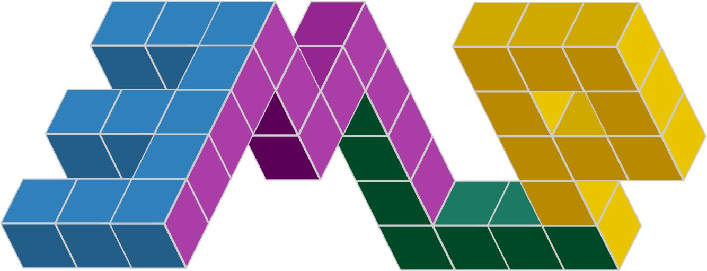

<div align="center">

</div>

# A Practical Method for Constructing Equivariant Multilayer Perceptrons for Arbitrary Matrix Groups
[](https://emlp.readthedocs.io/en/latest/) | **[Paper]()** | [](https://colab.research.google.com/github/mfinzi/equivariant-MLP/blob/master/docs/notebooks/colabs/all.ipynb) | [](https://pypi.org/project/emlp/)


*EMLP* is a jax library for the automated construction of equivariant layers in deep learning. You can read the documentation [here](https://emlp.readthedocs.io/en/latest/).

*WARNING*: Our library (and paper) have not yet been released, and may have sharp edges, bugs, and may be subject to breaking changes. 
Use at your own caution. But if you notice things behaving unexpectedly or get frustrated, send me an email so I can make the library better.

--------------------------------------------------------------------------------

We provide a type system for representations. With the operators ρᵤ⊗ρᵥ, ρᵤ⊕ρᵥ, ρ* implemented as `*`,`+` and `.T` build up different representations. The basic building blocks for representations are the base vector representation `V` and tensor representations `T(p,q) = V**p*V.T**q`. 

For any given matrix group and representation formed in our type system, you can get the equivariant basis with [`rep.equivariant_basis()`](https://emlp.readthedocs.io/en/latest/package/emlp.reps.html#emlp.reps.equivariant_basis) or a matrix which projects to that subspace with [`rep.equivariant_projector()`](https://emlp.readthedocs.io/en/latest/package/emlp.reps.html#emlp.reps.equivariant_projector). 


For example to find all O(1,3) (Lorentz) equivariant linear maps from from a 4-Vector Xᶜ to a rank (2,1) tensor Mᵇᵈₐ, you can run

```python
from emlp.reps import V,T
from emlp.groups import *

G = O13()
Q = (T(1,0)>>T(1,2))(G).equivariant_basis()
```

or how about equivariant maps from one Rubik's cube to another?
```python
G = RubiksCube()

Q = (V(G)>>V(G)).equivariant_basis()
```

Using `+` and `*` you can put together composite representations (where multiple representations are concatenated together). For example lets find all equivariant linear maps from 5 node features and 2 edge features to 3 global invariants and 1 edge feature of a graph of size n=5:
```python
G=S(5)

repin = 10*T(1)+5*T(2)
repout = 3*T(0)+T(2)
Q = (repin(G)>>repout(G)).equivariant_basis()
```

From the examples above, there are many different ways of writing a representation like `10*T(1)+5*T(2)` which are all equivalent.
`10*T(1)+5*T(2)` = `10*V+5*V**2` = `5*V*(2+V)` 
<!-- Feel free to go wild:
```python
W=V(O13())
repin = (W+2*W**2)*(W.T+1*W).T + W.T
repout = 3*W**0 + W + W*W.T
Q = (repin>>repout).equivariant_basis()
``` -->

You can even mix and match representations from different groups. For example with the cyclic group ℤ₃, the permutation group 𝕊₄, and the orthogonal group O(3)

```python
rep = 2*V(Z(3))*V(S(4))+V(O(3))**2
Q = (rep>>rep).equivariant_basis()
```

Outside of these tensor representations, our type system works with any finite dimensional linear representation and you can even build your own bespoke representations following the instructions [here](https://emlp.readthedocs.io/en/latest/notebooks/4new_representations.html).

You can visualize these equivariant bases with [`vis(repin,repout)`](https://emlp.readthedocs.io/en/latest/package/emlp.reps.html#emlp.reps.vis), such as with the three examples above

   
<!-- 
 -->


Checkout our [documentation](https://emlp.readthedocs.io/en/latest/) to see how to use our system and some worked examples.


# Installation instructions

To install as a package, run 
```bash
pip install emlp
```

To run the scripts you will instead need to clone the repo and install it locally which you can do with

```bash
git clone https://github.com/mfinzi/equivariant-MLP.git
cd equivariant-MLP
pip install -e .
```

# Experimental Results from Paper

Assuming you have installed the repo locally, you can run the experiments we described in the paper. 

To train the regression models on one of the `Inertia`, `O5Synthetic`, or `ParticleInteraction` datasets found in [`emlp.datasets.py`](https://github.com/mfinzi/equivariant-MLP/blob/master/emlp/datasets.py) you can run the script [`experiments/train_regression.py`](https://github.com/mfinzi/equivariant-MLP/blob/master/experiments/train_regression.py) with command line arguments specifying the dataset, network, and symmetry group. For example to train [`EMLP`](https://emlp.readthedocs.io/en/latest/package/emlp.nn.html#emlp.nn.EMLP) with [`SO(3)`](https://emlp.readthedocs.io/en/latest/package/emlp.groups.html#emlp.groups.SO) equivariance on the `Inertia` dataset, you can run

```
python experiments/train_regression.py --dataset Inertia --network EMLP --group "SO(3)"
```

or to train the MLP baseline you can run

```
python experiments/train_regression.py --dataset Inertia --network MLP
```
Other command line arguments such as `--aug=True` for data augmentation or `--ch=512` for number of hidden units and others are available, and you can browse the options and their defaults with `python experiments/train_regression.py -h`. If no group is specified, EMLP will automatically choose the one matched to the dataset, but you can also go crazy with any of the other groups implemented in [`groups.py`](https://github.com/mfinzi/equivariant-MLP/blob/master/emlp/groups.py) provided the dimensions match the data (e.g. for the 3D inertia dataset you could do `--group=` [`"Z(3)"`](https://emlp.readthedocs.io/en/latest/package/emlp.groups.html#emlp.groups.Z) or [`"DkeR3(3)"`](https://emlp.readthedocs.io/en/latest/package/emlp.groups.html#emlp.groups.DkeR3) but not [`"Sp(2)"`](https://emlp.readthedocs.io/en/latest/package/emlp.groups.html#emlp.groups.Sp) or [`"SU(5)"`](https://emlp.readthedocs.io/en/latest/package/emlp.groups.html#emlp.groups.SU)).

For the dynamical systems modeling experiments you can use the scripts
[`experiments/neuralode.py`](https://github.com/mfinzi/equivariant-MLP/blob/master/experiments/neuralode.py) to train (equivariant) Neural ODEs and [`experiments/hnn.py`](https://github.com/mfinzi/equivariant-MLP/blob/master/experiments/hnn.py) to train (equivariant) Hamiltonian Neural Networks.


For the dynamical system task, the Neural ODE and HNN models have special names. [`EMLPode`](https://emlp.readthedocs.io/en/latest/package/emlp.nn.html#emlp.nn.EMLPode) and [`MLPode`](https://emlp.readthedocs.io/en/latest/package/emlp.nn.html#emlp.nn.MLPode) for the Neural ODEs in `neuralode.py` and [`EMLPH`](https://emlp.readthedocs.io/en/latest/package/emlp.nn.html#emlp.nn.EMLPH) and [`MLPH`](https://emlp.readthedocs.io/en/latest/package/emlp.nn.html#emlp.nn.MLPH) for the HNNs in `hnn.py`. For example,

```
python experiments/neuralode.py --network EMLPode --group="O2eR3()"
```
or 

```
python experiments/hnn.py --network EMLPH --group="DkeR3(6)"
```

These models are trained to fit a double spring dynamical system. 30s rollouts of the dataset, along with rollout error on these trajectories, and conservation of angular momentum are shown below.

   

<!-- # 
<p align="center">
  
</p> -->

If you find our work helpful, please cite it with
```bibtex
@article{finzi2021emlp,
  title={A Practical Method for Constructing Equivariant Multilayer Perceptrons for Arbitrary Matrix Groups},
  author={Finzi, Marc and Welling, Max and Wilson, Andrew Gordon},
  journal={Arxiv},
  year={2021}
}
```
<!-- 
Top quark tagging dataset: https://zenodo.org/record/2603256#.YAoEPehKiUl -->
